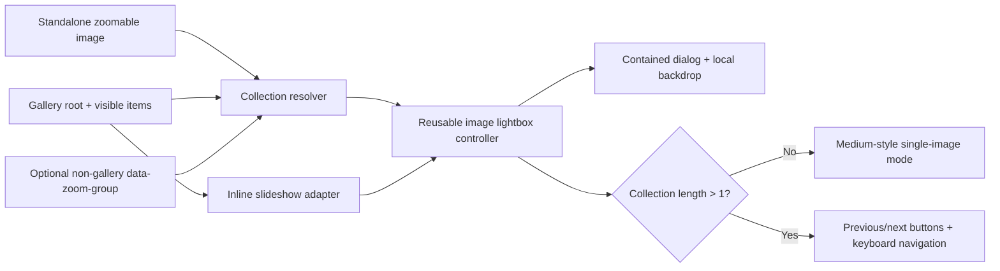

# feat: Add image lightbox zoom

## Overview

Add a Medium-inspired, reusable image lightbox that works in two modes:
- standalone image mode, where a single image opens and closes like Medium
- collection mode, where gallery or grouped images open in the same overlay with previous/next navigation

Both modes should render inside the preview canvas, preserve the spatial expand/collapse feel, and share one lightbox engine. The implementation should keep the useful parts of `medium-zoom` for modern use: container-aware rendering, HD-image handoff, explicit lifecycle, and standalone scroll-to-close. It should not hardcode either the single-image assumptions of Medium or the gallery-only assumptions of the current plan.

## Problem Frame

The current gallery supports `grid`, `masonry`, and `slideshow` layouts, but every image stays at thumbnail scale. The previous plan adapted Medium-style zoom for gallery browsing, but the user also wants the same core behavior to work for a standalone editorial image on a page.

A gallery-only controller would solve the immediate need but leave the codebase with the wrong abstraction boundary. The better refactor is a reusable image-lightbox core whose collection model can represent either a single image or a sequence of images. Gallery integration then becomes one adapter, not the defining shape of the feature.

This repo also has a non-negotiable architectural constraint: overlays must stay inside the simulated preview viewport, not the browser's top layer. Any plan that relies on `position: fixed` or `dialog.showModal()` will fight the shell and recreate known containment bugs.

## Requirements Trace

- R1. Clicking a zoomable image opens a larger lightbox view inside the nearest preview/page container.
- R2. Standalone single-image mode behaves like Medium: open, close, focus return, no unnecessary previous/next chrome, and close-on-scroll after a clear threshold.
- R3. Collection mode supports previous/next navigation with on-screen buttons, `ArrowLeft` / `ArrowRight`, and simple left/right swipe gestures, and does not close just because the page or host container scrolls.
- R4. Open and close preserve the spatial "expand from the clicked image" feel, with a reduced-motion fallback.
- R5. Collection resolution works for both a gallery's currently visible items and a standalone image's one-item sequence.
- R6. The overlay remains contained inside the preview shell and cleans up correctly on section switch, layout change, and destroy.
- R7. Optional HD-image overrides work in both standalone and collection modes.
- R8. The implementation stays framework-free, strict-TypeScript-friendly, and covered by Playwright.

## Scope Boundaries

- No pinch-to-zoom, wheel zoom, drag-to-pan, or gesture-heavy image manipulation in this pass.
- No third-party lightbox dependency; this is an in-repo implementation informed by `medium-zoom`, not a wrapper around it.
- Do build a reusable image-lightbox core for image surfaces, but do not expand it into a shell-wide cross-media viewer abstraction.

### Deferred to Separate Tasks

- Kinetic slide transitions, momentum physics, and drag-follow interactions.
- Reusing the same controller for non-image media types.
- Rich lightbox chrome beyond what is needed for navigation and accessibility, such as caption trays or thumbnail strips.

## Context & Research

### Relevant Code and Patterns

- `src/gallery.section.ts` mounts the gallery and persists state by copying `dataset` values plus scoped CSS custom properties.
- `src/gallery.controls.ts` owns gallery-specific lifecycle, visible-image count, and slideshow re-initialization when layout-dependent state changes; it is the natural place for the gallery adapter, not the reusable lightbox core.
- `src/gallery.slideshow.ts` already has useful patterns for `aria-live`, previous/next controls, keyboard handling, autoplay pause/resume, and inerting non-active content. Those patterns should be shared conceptually but not duplicated.
- `src/gallery.partial.html` provides one shared figure/image structure for all gallery layouts, which is the right place to add collection-mode trigger hooks.
- `src/main.ts` and the section registry show the simplest repo-native way to prove standalone mode: add a lightweight single-image section to the prototype.
- `src/main.css` is the stylesheet aggregation point, so shared lightbox styling should live in its own imported CSS file rather than being buried in `src/gallery.css`.
- `src/shell.ts` destroys and recreates sections on switch and exposes `setOnViewportChange()`, which the lightbox can use to remeasure itself when the preview width changes.
- The repo uses a flat `src/` module layout, so shared lightbox modules should stay as sibling files instead of introducing a mini framework directory.

### Institutional Learnings

- `docs/solutions/ui-bugs/fixed-overlay-containment-preview.md` establishes the local rule: do not use `position: fixed` or `showModal()` inside `#preview-root`; use contained absolute positioning and normal-DOM dialog behavior instead.

### External References

- `medium-zoom` README: keep the ideas of container-scoped rendering, explicit open/close lifecycle, margin/background configuration, and an HD-image override (`data-zoom-src`). Its single-image API shape is still useful for standalone mode, but collection mode needs a wrapper on top of that core. Source: <https://github.com/francoischalifour/medium-zoom>
- `medium-zoom` issue surface shows why a gallery-native refactor is safer than a direct port: open issues call out `Tab`-close edge cases, dialog questions, `srcset` misalignment, viewport-positioning bugs, and iframe/container bugs. Source: <https://github.com/francoischalifour/medium-zoom/issues>
- WAI-ARIA Dialog pattern defines the required modal behavior: move focus into the dialog, keep `Tab` inside it, close on `Escape`, and return focus to the invoker. Source: <https://www.w3.org/WAI/ARIA/apg/patterns/dialog-modal/>
- WAI-ARIA Carousel pattern confirms the inline slideshow behavior the lightbox should respect: explicit prev/next controls, `aria-live` management, and pausing auto-rotation when focus enters. Source: <https://www.w3.org/WAI/ARIA/apg/patterns/carousel/>
- MDN documents why `showModal()` is wrong for this repo: it places the dialog in the top layer and inerts the rest of the document. Sources: <https://developer.mozilla.org/en-US/docs/Web/API/HTMLDialogElement/showModal>, <https://developer.mozilla.org/en-US/docs/Web/HTML/Reference/Elements/dialog>
- web.dev's 2025 gallery article reinforces that modern platform primitives are good enough for this feature and that loading larger images only when the dialog opens is a practical gallery pattern. Source: <https://web.dev/articles/baseline-in-action-image-gallery?hl=en>

## Key Technical Decisions

- Build a reusable image-lightbox engine instead of integrating `medium-zoom` directly.
Rationale: `medium-zoom` is optimized around attach/detach/open/close on one zoomed image. This repo needs one engine that can treat a standalone image as a one-item sequence and a gallery as a multi-item sequence without forking the interaction model.

- Put collection discovery behind thin adapters.
Rationale: gallery mode should discover currently visible items from a gallery root, while standalone mode should attach to any zoomable image or optional grouped set of images. The core controller should not care where its collection came from.

- Preserve Medium's spatial open/close feel, but use a dedicated overlay image plus FLIP-style measurement instead of treating the inline image clone as the long-lived source of truth.
Rationale: open and close can still anchor to the clicked thumbnail, while in-lightbox navigation becomes a normal overlay index change instead of repeated clone orchestration.

- Use a contained `<dialog>` opened with `.show()`, not `.showModal()`.
Rationale: this matches the repo's containment rule. Because `.show()` does not provide the modal top-layer backdrop that `showModal()` would, the implementation will add a local backdrop element plus manual inerting, focus trapping, backdrop dismissal, and `Escape` handling so the dialog behaves modally inside the preview shell.

- In collection mode, only the adapter decides sequence membership.
Rationale: for galleries, that means visible `figure.gallery__item:not([hidden])` entries; for standalone use, that usually means exactly one item. This keeps sequence policy out of the core controller.

- Show previous/next controls only when the collection length is greater than 1, and keep navigation bounded rather than wrapping.
Rationale: standalone mode should feel like Medium, not like an empty carousel. In multi-image mode, disabling prev/next at the ends keeps orientation clear and makes close-to-thumbnail animation more predictable than teleporting from last to first.

- Add simple swipe navigation in collection mode only, using directional threshold detection rather than drag-follow or momentum physics.
Rationale: touch navigation is a natural fit when browsing a sequence of images, but the repo does not need kinetic gesture complexity in the first pass. Threshold-based swipe keeps implementation and testing manageable.

- Retain scroll-to-close only for one-item standalone mode, using a configurable threshold like `medium-zoom`'s `scrollOffset`.
Rationale: scroll-dismiss is part of the expected Medium-like feel for a single editorial image, but it fights the browsing model in collection mode where incidental page/container scroll should not collapse the lightbox mid-sequence.

- Pause slideshow autoplay when the lightbox opens, and resume it only if autoplay was active before open and the gallery is still in `slideshow` mode on close.
Rationale: this follows the carousel accessibility guidance and avoids stacked motion systems. Standalone mode has no special coordinator beyond the lightbox itself.

- Support optional grouping for non-gallery pages with a lightweight attribute contract.
Rationale: a standalone image should default to one-item Medium mode, but the same reusable core becomes more future-proof if non-gallery pages can opt a few editorial images into the same sequence with something lightweight like `data-zoom-group`.

- Recompute geometry on viewport-width changes, but close the lightbox on layout changes, visible-image-count changes, and section destroy.
Rationale: viewport changes are responsive resizes of the same session; collection mutations are safer to handle by closing and rebuilding state.

- Resolve the full-size image from a `data-zoom-src` override when present, otherwise from `img.currentSrc`.
Rationale: this keeps the helpful HD-image idea from `medium-zoom` while preferring native responsive-image resolution by default in both standalone and collection modes.

## Alternative Approaches Considered

- Directly wrap `medium-zoom`
Why not chosen: strongest parity for standalone Medium behavior and the lowest initial code volume, but it breaks down once collection mode, swipe, slideshow coordination, and preview-container containment become first-class requirements. The repo would end up with a wrapper plus patches, which is harder to reason about than owning the core behavior outright.

- Keep two separate implementations: `medium-zoom`-style standalone plus a custom gallery viewer
Why not chosen: this lowers abstraction pressure in the short term, but it creates duplicate close/focus/containment logic, duplicate tests, and eventual divergence between single-image and gallery modes. The user explicitly wants both surfaces to feel like one family of behavior.

- Build a gallery-only controller and adapt standalone pages later
Why not chosen: this was the previous direction. It would solve the gallery use case, but it sets the wrong seam for the codebase because standalone Medium-style zoom then becomes a retrofit instead of a supported mode.

- Use top-layer modal behavior with `showModal()` or a fixed-position overlay
Why not chosen: it is simpler on a normal document page, but it conflicts with the shell’s preview-container architecture and repeats a known class of overlay containment bugs documented in `docs/solutions/ui-bugs/fixed-overlay-containment-preview.md`.

- Use a drag-follow carousel model for collection mode from the start
Why not chosen: this can feel more polished on touch devices, but it adds gesture state, snap physics, and more brittle testing surface before the core standalone/collection architecture is proven. Threshold-based swipe is a better first pass.

- Chosen approach: one reusable image-lightbox controller with thin collection adapters
Why chosen: it preserves Medium-style standalone behavior, supports gallery browsing without a separate overlay system, respects the repo’s containment constraints, and keeps the implementation size proportional to the project.

## Open Questions

### Resolved During Planning

- Reuse the library or implement locally: implement locally.
- Modal strategy: contained `<dialog>.show()` plus manual modal behavior, not `showModal()`.
- Architecture shape: reusable core plus adapters, not a gallery-only controller.
- Gallery sequence membership: only currently visible images.
- Standalone default: one-item sequence with no prev/next chrome.
- Non-gallery grouping: allow an optional attribute-based grouping contract.
- Navigation bounds: bounded, not wrapping.
- Swipe behavior: enabled for collection mode, disabled for standalone mode.
- Scroll dismiss: enabled for standalone one-item mode, disabled for collection mode.
- Autoplay interaction: pause on open, conditionally resume on close.

### Deferred to Implementation

- Attribute naming: reuse `data-zoom-src` for continuity with `medium-zoom`, and decide whether non-gallery grouping uses `data-zoom-group` or stays adapter-only. Default assumption if unanswered: reuse `data-zoom-src` and add `data-zoom-group`.
- Animation tuning: exact easing, duration, and whether in-lightbox image changes crossfade or slide slightly. Default assumption if unanswered: keep it simple with opacity/transform and honor `prefers-reduced-motion`.
- Visible caption treatment inside the lightbox. Default assumption if unanswered: no new caption tray in v1; rely on the image alt text and counter for accessible context.
- Swipe thresholds: exact horizontal-distance / vertical-intent rules and whether pointer events or touch events own the gesture path. Default assumption if unanswered: use a simple horizontal-threshold gesture with vertical-intent guard, implemented through pointer events when practical.
- Scroll threshold source: whether the implementation reads a shared constant, per-instance option, or data attribute. Default assumption if unanswered: use a shared controller constant analogous to `scrollOffset`.
- Standalone verification surface: whether the prototype keeps a permanent single-image section or uses a lighter-weight fixture. Default assumption if unanswered: add a lightweight single-image section because this repo needs an end-to-end target.

## High-Level Technical Design

> *This illustrates the intended approach and is directional guidance for review, not implementation specification. The implementing agent should treat it as context, not code to reproduce.*

## Implementation Units

- [ ] **Unit 1: Establish a reusable lightbox DOM and CSS contract**

**Goal:** Create shared markup and styling primitives that can support both standalone images and gallery collections.

**Requirements:** R1, R2, R4, R6, R8

**Dependencies:** None

**Files:**
- Create: `src/image-lightbox.css`
- Modify: `src/main.css`
- Modify: `src/gallery.partial.html`
- Test: `tests/image-lightbox.spec.ts`

**Approach:**
- Introduce shared lightbox classes and data hooks used by every zoomable surface.
- Wrap each openable gallery image in a trigger element with stable image identity hooks and accessible labeling.
- Define shared overlay, local backdrop, stage, counter, close button, and prev/next styling in `src/image-lightbox.css` so standalone mode does not depend on gallery-specific selectors.
- Keep the overlay contained with `position: absolute; inset: 0;` inside the host surface, never `position: fixed`.
- Add reduced-motion and focus-visible styles up front so the controller can stay logic-focused.

**Patterns to follow:**
- `src/gallery.partial.html`
- `src/main.css`
- `docs/solutions/ui-bugs/fixed-overlay-containment-preview.md`

**Test scenarios:**
- Happy path: tab to a zoomable trigger and activate it with `Enter`; the contained lightbox becomes visible.
- Happy path: clicking a gallery image opens the matching image in the overlay.
- Edge case: hidden items from the image-count control are not focusable/openable.
- Edge case: the shared trigger/backdrop markup preserves existing grid, masonry, and slideshow item sizing instead of breaking current layout selectors.
- Edge case: single-image mode renders no visible prev/next chrome when the collection has one item.

**Verification:**
- Shared lightbox primitives exist, gallery layout remains intact, and the overlay is visually constrained to the host surface.

- [ ] **Unit 2: Extract a generic zoom target and collection model**

**Goal:** Replace gallery-only item discovery with a generic resolver that can represent one-item and multi-item image collections.

**Requirements:** R1, R2, R3, R5, R7, R8

**Dependencies:** Unit 1

**Files:**
- Create: `src/image.targets.ts`
- Modify: `src/gallery.slideshow.ts`
- Modify: `src/gallery.controls.ts`
- Test: `tests/image-lightbox.spec.ts`

**Approach:**
- Introduce a helper that resolves per-item metadata for any zoomable image: trigger element, inline image element, `alt`, `currentSrc`, optional HD override, caption text if present, and optional group identity.
- Support three resolver shapes:
  - one explicit standalone image
  - a grouped set of non-gallery images
  - gallery-visible items in DOM order
- Refactor `src/gallery.slideshow.ts` to consume the shared collection model instead of querying its own `NodeList`.
- Keep current index ephemeral; do not store open state or lightbox index in `dataset`.

**Patterns to follow:**
- `src/gallery.slideshow.ts`
- `src/gallery.controls.ts`

**Test scenarios:**
- Happy path: a standalone image resolves to a one-item collection.
- Happy path: visible-item ordering matches DOM ordering in `grid`, `masonry`, and `slideshow`.
- Edge case: changing image count removes hidden items from the shared sequence.
- Integration: slideshow pagination and lightbox both point at the same current item ordering after controls changes.
- Edge case: ungrouped non-gallery images do not accidentally form one shared collection.
- Error path: missing optional HD override still produces a valid resolved full-size source via `currentSrc`.

**Verification:**
- One shared collection model drives standalone mode, gallery mode, and inline slideshow behavior, with no duplicated visible-item logic left behind.

- [ ] **Unit 3: Implement the reusable contained lightbox controller**

**Goal:** Build the actual lightbox controller: spatial open/close animation, focus management, source loading, and conditional navigation based on collection size.

**Requirements:** R1, R2, R3, R4, R5, R6, R7

**Dependencies:** Unit 2

**Files:**
- Create: `src/image.lightbox.ts`
- Modify: `src/image-lightbox.css`
- Test: `tests/image-lightbox.spec.ts`

**Approach:**
- Accept a resolved collection plus host container rather than discovering gallery state internally.
- On open, capture the invoker and thumbnail geometry, resolve the full-size image, call `dialog.show()`, enable the local backdrop, inert non-dialog gallery content, move focus inside, and animate from thumbnail rect to stage rect.
- Keep previous/next, close, and counter state inside the controller. Only render/show previous and next controls when the collection length is greater than `1`, and disable them at the sequence bounds.
- Support `Escape`, backdrop click, and explicit close button dismissal.
- In collection mode, detect simple left/right swipe gestures and translate them into previous/next navigation once the gesture crosses a horizontal threshold and clearly exceeds vertical intent.
- In standalone one-item mode, listen for page or host-container scroll deltas and close once the configured threshold is exceeded; disable that path entirely in collection mode.
- Preload adjacent images with `Image.decode()` where possible, but fall back to the inline source if decode fails or the HD asset is unavailable.
- When closing, animate back to the current thumbnail if it is still in the visible sequence; otherwise use a simple fade/scale-out fallback.

**Patterns to follow:**
- `src/gallery.slideshow.ts`
- WAI dialog pattern
- `medium-zoom` container and lifecycle concepts

**Test scenarios:**
- Happy path: opening a standalone image shows the large image with no prev/next controls.
- Happy path: scrolling past the configured threshold in standalone mode closes the lightbox and restores focus to the trigger.
- Happy path: clicking image 3 in a collection opens image 3, `Next` opens image 4, `Previous` returns to image 3.
- Happy path: swiping left in collection mode advances one image and swiping right goes back one image.
- Happy path: `ArrowRight` and `ArrowLeft` navigate without moving focus out of the lightbox.
- Happy path: `Escape` closes the lightbox and restores focus to the invoking trigger.
- Edge case: previous is disabled on the first image and next is disabled on the last image in collection mode.
- Edge case: short drags or mostly vertical gestures do not trigger swipe navigation.
- Edge case: incidental scroll while in collection mode does not close the lightbox.
- Error path: if the large image cannot be decoded, the controller falls back to the inline source instead of leaving a blank stage.
- Integration: opening from slideshow pauses autoplay and preserves the inline slideshow state after close.
- Edge case: closing from an image whose thumbnail is no longer visible falls back to fade-out instead of breaking the close animation.

**Verification:**
- The controller behaves like a contained Medium-style zoom in single-image mode and like a bounded image viewer in collection mode.

- [ ] **Unit 4: Integrate the gallery adapter**

**Goal:** Wire the existing gallery section to the reusable controller without pushing gallery assumptions down into the core.

**Requirements:** R1, R3, R4, R5, R6, R7, R8

**Dependencies:** Unit 3

**Files:**
- Modify: `src/gallery.controls.ts`
- Modify: `src/gallery.section.ts`
- Modify: `src/gallery.css`
- Test: `tests/image-lightbox.spec.ts`

**Approach:**
- Use event delegation from the gallery root to turn visible gallery items into a collection-mode adapter.
- Reuse the gallery's existing visible-item, image-count, and slideshow state so the overlay sequence always mirrors what the user sees.
- Pause slideshow autoplay on open and resume it only when autoplay was active before open and the gallery remains in slideshow mode on close.
- Close the lightbox before layout changes or visible-image-count changes trigger downstream reinitialization.

**Patterns to follow:**
- `src/gallery.controls.ts`
- `src/gallery.section.ts`
- `src/gallery.css`

**Test scenarios:**
- Happy path: open from `grid`, `masonry`, and `slideshow`, and confirm the right image index opens in each layout.
- Happy path: swipe navigation works when the overlay was opened from gallery collection mode.
- Edge case: open from slideshow, close the overlay, and confirm inline slideshow state is preserved.
- Edge case: change gallery layout or visible image count while open, and confirm the lightbox closes cleanly.
- Integration: gallery mode never includes hidden images in the overlay sequence.

**Verification:**
- The gallery uses the generic controller successfully without leaking gallery-specific policy into shared modules.

- [ ] **Unit 5: Add a standalone single-image prototype surface**

**Goal:** Give the prototype a real single-image surface so the reusable architecture is exercised end-to-end, not just promised in abstraction.

**Requirements:** R1, R2, R4, R6, R7, R8

**Dependencies:** Unit 3

**Files:**
- Create: `src/single-image.partial.html`
- Create: `src/single-image.section.ts`
- Create: `src/single-image.css`
- Modify: `src/main.ts`
- Modify: `src/main.css`
- Test: `tests/image-lightbox.spec.ts`

**Approach:**
- Add a lightweight "Single Image" section that renders one editorial-style zoomable image and no gallery controls.
- Attach the same lightbox controller in standalone mode so the prototype proves the Medium-like path directly.
- Keep the section intentionally minimal: the important behavior is the interaction contract, not additional controls.

**Patterns to follow:**
- `src/gallery.section.ts`
- `src/nav.section.ts`

**Test scenarios:**
- Happy path: open the standalone image and confirm it behaves like a one-image Medium zoom.
- Happy path: `Escape` closes the standalone lightbox and restores focus to the trigger.
- Happy path: scrolling the preview/page past the threshold closes the standalone lightbox.
- Edge case: previous/next controls remain hidden or inert in the standalone section.
- Integration: the standalone section works across the simulated preview widths.

**Verification:**
- The prototype has a concrete standalone-image entry point using the same shared lightbox engine.

- [ ] **Unit 6: Wire lifecycle, viewport updates, and focused Playwright coverage**

**Goal:** Make the reusable lightbox robust under section switching, viewport changes, and cleanup while adding durable regression coverage.

**Requirements:** R1, R2, R3, R4, R5, R6, R7, R8

**Dependencies:** Units 4-5

**Files:**
- Modify: `src/gallery.section.ts`
- Modify: `src/gallery.controls.ts`
- Modify: `src/single-image.section.ts`
- Test: `tests/image-lightbox.spec.ts`
- Modify: `tests/shell-switching.spec.ts`

**Approach:**
- Use the existing `setOnViewportChange()` hook so an open lightbox can remeasure and re-center when the preview width changes; no shell API expansion is expected.
- Ensure section destroy closes the lightbox and removes inert attributes, backdrop state, and invoker references in both gallery and standalone modes.
- Create a dedicated `tests/image-lightbox.spec.ts` for standalone-mode and collection-mode interaction coverage.
- Keep shell-level cleanup and persistence cases in `tests/shell-switching.spec.ts`.

**Patterns to follow:**
- `src/shell.ts`
- `tests/shell-switching.spec.ts`

**Test scenarios:**
- Happy path: standalone mode and gallery mode both remain contained at `375`, `768`, and `1280` preview widths.
- Happy path: focus remains trapped inside the lightbox until close.
- Edge case: opening the lightbox, switching sections, and returning does not persist open overlay state.
- Edge case: autoplay pauses while open and resumes only when appropriate after close.
- Edge case: swipe navigation only applies in collection mode and does not affect standalone Medium-style mode.
- Integration: section restore never persists an open lightbox or active lightbox index across remounts.

**Verification:**
- The regression suite covers containment, focus, navigation, autoplay interaction, standalone mode, collection mode, and teardown.

## System-Wide Impact

- **Interaction graph:** standalone trigger or gallery adapter -> collection resolver -> reusable lightbox controller -> optional slideshow coordinator -> shell viewport callback.
- **Error propagation:** large-image load or decode failures should stay local to the lightbox and fall back gracefully; section init failures should still bubble through the shell's existing `try`/`catch`.
- **State lifecycle risks:** orphaned inert state, focus not returning, autoplay continuing underneath the modal, geometry going stale during preview-width changes, and single-image/collection-mode divergence.
- **State lifecycle risks:** orphaned inert state, focus not returning, autoplay continuing underneath the modal, geometry going stale during preview-width changes, single-image/collection-mode divergence, and scroll listeners closing the wrong mode.
- **State lifecycle risks:** orphaned inert state, focus not returning, autoplay continuing underneath the modal, geometry going stale during preview-width changes, single-image/collection-mode divergence, scroll listeners closing the wrong mode, and swipe listeners hijacking vertical scroll intent.
- **API surface parity:** existing gallery controls and persisted `dataset` state remain intact; the new image-level API should stay small, ideally limited to optional attributes such as `data-zoom-src` and `data-zoom-group`.
- **Integration coverage:** open from standalone mode, open from all gallery layouts, close during section switch, close during layout/image-count changes, and open while slideshow autoplay is active.
- **Unchanged invariants:** the shell still mounts/unmounts sections fully, gallery state is still `data-*`-driven, and slideshow behavior is unchanged when the lightbox is closed.

## Risks & Dependencies

| Risk | Mitigation |
|------|------------|
| Modal containment regresses and the overlay escapes the preview shell | Keep the overlay absolutely positioned inside `.gallery` and explicitly forbid `showModal()` / `position: fixed` in the implementation notes and tests |
| Focus trap or inert cleanup breaks after destroy or layout changes | Centralize open/close cleanup in one controller and cover section-switch + layout-change teardown in Playwright |
| Responsive image handling picks the wrong large source or misreads `srcset` | Default to `img.currentSrc`, allow an explicit override, and test both paths |
| Animation quality degrades on small previews or reduced-motion systems | Use simple transform/opacity animation primitives and fall back to minimal motion under `prefers-reduced-motion` |
| Adding trigger/backdrop markup breaks existing gallery CSS selectors | Update selectors deliberately around `.gallery__trigger` and cover all three gallery layouts in the regression suite |
| The reusable core becomes too abstract for the repo's size | Keep the abstraction image-only, use thin adapters, and prove it immediately with one standalone section plus the gallery |
| Single-image and collection modes drift into separate implementations | Keep one controller and make mode differences data-driven from collection length |
| Scroll-to-close feels flaky or closes while browsing a collection | Gate scroll-dismiss on one-item mode only, use a clear threshold, and add explicit standalone-vs-collection regression coverage |
| Swipe navigation interferes with normal vertical touch scrolling | Require horizontal dominance and minimum distance before navigation, and test that mostly vertical gestures do not trigger image changes |

## Documentation / Operational Notes

- If the implementation adopts a new per-image attribute such as `data-zoom-src`, document that convention near the gallery markup pattern so future image additions keep the contract consistent.
- If the implementation adopts optional grouping such as `data-zoom-group`, document that contract near the standalone image pattern so future non-gallery pages do not accidentally create surprising sequences.
- The containment rule from `docs/solutions/ui-bugs/fixed-overlay-containment-preview.md` should be referenced in any future overlay work touching the preview shell.

## Sources & References

- Related code: `src/gallery.section.ts`
- Related code: `src/gallery.controls.ts`
- Related code: `src/gallery.slideshow.ts`
- Related code: `src/gallery.partial.html`
- Related code: `src/gallery.css`
- Related code: `src/main.ts`
- Related code: `src/main.css`
- Related code: `src/shell.ts`
- Institutional learning: `docs/solutions/ui-bugs/fixed-overlay-containment-preview.md`
- Prior gallery planning reference: `plans/feat-gallery-styles-grid-slideshow-masonry.md`
- External docs: <https://github.com/francoischalifour/medium-zoom>
- External docs: <https://github.com/francoischalifour/medium-zoom/issues>
- External docs: <https://www.w3.org/WAI/ARIA/apg/patterns/dialog-modal/>
- External docs: <https://www.w3.org/WAI/ARIA/apg/patterns/carousel/>
- External docs: <https://developer.mozilla.org/en-US/docs/Web/API/HTMLDialogElement/showModal>
- External docs: <https://developer.mozilla.org/en-US/docs/Web/HTML/Reference/Elements/dialog>
- External docs: <https://web.dev/articles/baseline-in-action-image-gallery?hl=en>
