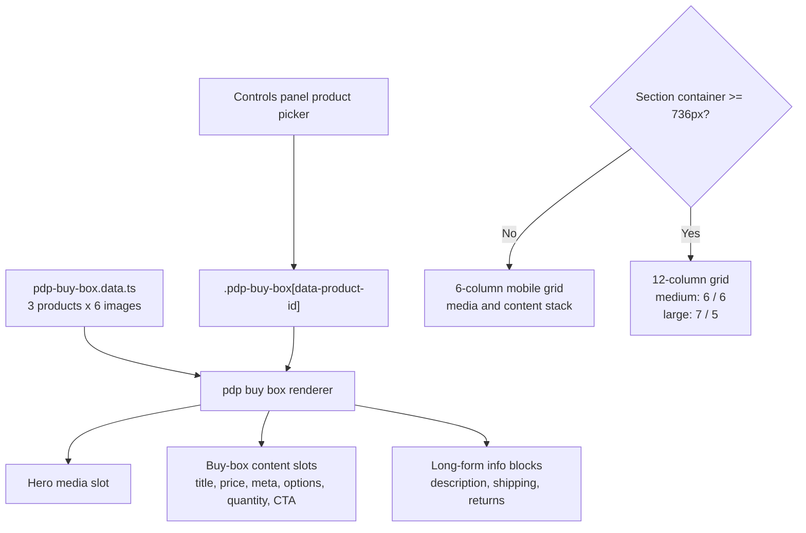

# feat: Add PDP buy box section

## Overview

Add a new `PDP Buy Box` section to the prototype shell. The first pass should reproduce the structure shown in the three Figma frames: stacked media and purchase details on mobile, then a split media/details composition on larger viewports. The section should use a CSS Grid layout with a 6-column mobile grid and a 12-column grid above the existing section breakpoint, and it should expose a control-panel product picker that swaps between three fake products.

The section also needs seeded fake merch data for iteration: three products, each with six generated images, product-specific copy, and option labels/values. The initial UI should stay faithful to the Figma structure rather than inventing a full gallery or commerce flow.

## Problem Frame

The shell currently demonstrates navigation, gallery, and single-image sections, but it does not yet cover a product-detail layout. The user wants a new section that exercises a storefront PDP buy box pattern using the repo’s established section lifecycle: raw partial HTML, section-specific CSS, isolated controls, and state persistence through the shell.

The referenced Figma node shows three responsive frames of the same concept rather than three different experiences. The structure is consistent across them:
- one lead product image
- a buy-box details column with title, price/meta, one select-style option group, one chip-style option group, quantity + CTA
- long-form copy blocks for description, shipping, and returns

The plan should therefore prioritize structural fidelity, responsive grid behavior, and data-driven fake content. Pixel-perfect spacing, richer media browsing, and real commerce logic can follow in later iterations.

## Requirements Trace

- R1. Add a new section registered in the shell as `PDP Buy Box`.
- R2. Build the section with CSS Grid using a 6-column grid by default and a 12-column grid above the existing larger-width breakpoint.
- R3. Match the broad Figma structure across the three frames: stacked mobile layout, split media/details layout above mobile, one select-style option group plus one chip-style option group, and the same block order/content hierarchy in all sizes.
- R4. Seed three fake products and allow switching between them from the controls panel.
- R5. Give each fake product six generated images stored in the repo and wired into the product data contract.
- R6. Keep the initial in-section media presentation aligned to the Figma frames: one hero image visible in the section UI, with the remaining generated images available in data for later iteration.
- R7. Follow existing shell conventions for mount/unmount, state persistence, and strict TypeScript.
- R8. Cover the new section with Playwright tests for picker registration, product switching, responsive structure, and state round-tripping.
- R9. Use the three frame-level Figma references as the implementation verification baseline when the section is complete.

## Scope Boundaries

- No real cart submission, inventory logic, or backend product integration.
- No attempt to recreate a complete PDP media gallery UI if the Figma frames do not show one.
- No lightbox, zoom, sticky buy box, or thumbnail rail in this pass.
- No schema-generalized commerce component system; this is one prototype section following existing local patterns.

### Deferred to Separate Tasks

- Pixel-tuning typography, spacing, and micro-interactions after the first structure pass is visible in the prototype.
- Adding richer media browsing behavior for the six seeded images.
- Wiring inventory, selling plans, payment widgets, or live cart behavior.

## Context & Research

### Relevant Code and Patterns

- `src/shell.ts` defines the section lifecycle, URL-backed state cache, and viewport switching behavior that the new section must plug into.
- `src/gallery.section.ts` and `src/single-image.section.ts` show the standard lightweight section wrapper pattern for init/destroy/saveState.
- `src/nav.section.ts` shows the repo’s precedent for restoring non-trivial section state during init when DOM state alone is insufficient.
- `src/gallery.css` shows the repo’s current CSS Grid and container-query style for section layout, including the existing `@container (min-width: 736px)` breakpoint convention aligned with the shell’s `768` viewport option.
- `src/control-builders.ts` and the current controls modules show the expected controls-panel construction style: build DOM imperatively, scope listeners with an `AbortController`, and keep section-specific logic in the section’s own controls file.
- `tests/shell-switching.spec.ts` is the regression surface for section registration, picker options, state persistence, and viewport interactions.
- `public/images/*` establishes the current convention of repo-served prototype imagery under `public/images/`.

### Figma Frame References

- `small` frame `5677:6467` (`375 × 1639`) is the mobile reference.
  It uses `16px` page insets, a `343 × 343` hero image, stacked details, full-width `343px` variant controls, and a quantity/CTA row split into `104px` and `228px` controls with an `11px` gap.
- `medium` frame `5677:6468` (`760 × 1371`) is the tablet reference.
  It uses `24px` outer gutters, a balanced two-column composition with a `348px` image, a `348px` right column, and a `16px` gap between them.
- `large` frame `5677:6469` (`1280 × 1195`) is the desktop reference.
  It uses `24px` outer gutters, a `705px` media column, a `495px` details column, and a `32px` gap between them.
- Across all three frames, the vertical content order is stable:
  title and price row, BNPL row, dropdown variant group, chip/button variant group, quantity + CTA row, inline shipping/returns detail line, then long-form `Description`, `Shipping`, and `Returns` copy.
- Figma variable definitions on the frame expose shared visual tokens that should guide implementation tuning:
  `Geist` type, `20px` bold heading, `18px` heading-sm, `15px` body, `12px` small label, base black `#10100b`, and spacing tokens `8` and `16`.
- The layer tree partially flattens the lower copy area, but the frame screenshots clearly show separate `Shipping` and `Returns` headings.
  The visible frame output should win if layer metadata and screenshots disagree.

### Institutional Learnings

- `docs/solutions/ui-bugs/fixed-overlay-containment-preview.md` is not directly exercised by this section, but it reinforces the preview-shell constraint that section UI must remain container-scoped. If later iterations add modal or gallery behavior, they must stay inside `#preview-root`.

### External References

- Figma `small` frame: `https://www.figma.com/design/R0XZIBHkSCQkbUcirqg8vo/Kiln?node-id=5677-6467&t=hGcIWhStxnsXUpjb-1`
- Figma `medium` frame: `https://www.figma.com/design/R0XZIBHkSCQkbUcirqg8vo/Kiln?node-id=5677-6468&t=hGcIWhStxnsXUpjb-1`
- Figma `large` frame: `https://www.figma.com/design/R0XZIBHkSCQkbUcirqg8vo/Kiln?node-id=5677-6469&t=hGcIWhStxnsXUpjb-1`

## Key Technical Decisions

- Store fake PDP content in a dedicated data module instead of inlining it inside the partial HTML or controls file.
Rationale: three products with six images each, long-form copy, and option metadata are too large and too structured for inline literals scattered across markup or controls code.

- Use a semantic HTML skeleton plus data-slot hydration instead of hardcoding one product into the partial.
Rationale: the section needs to swap product title, price, option labels, CTA copy, and image source from the control panel without replacing the whole section DOM or maintaining three duplicated markup trees.

- Use `container-type: inline-size` on the section root and switch from a 6-column grid to a 12-column grid at `@container (min-width: 736px)`.
Rationale: this matches the repo’s existing container-query convention and aligns with the shell’s viewport presets without introducing a second breakpoint philosophy.

- On 12-column layouts, use breakpoint-specific spans instead of one fixed split:
  the medium layout should read as an even `6 / 6` composition, while the large layout should shift to a media-heavier `7 / 5` composition.
Rationale: the resolved frame geometry shows the medium frame as a balanced `348 / 16 / 348` split, while the large frame shifts to `705 / 32 / 495`. One fixed span ratio would miss one of those references.

- Keep only one hero image visible in the section UI for v1, even though each product owns six images.
Rationale: the Figma frames show one lead image, not a thumbnail rail or carousel. The extra images should still be generated and stored so later iterations can add richer media behavior without regenerating assets.

- Persist only the selected product ID in shell state for v1.
Rationale: the user explicitly asked for product switching in the controls panel. Variant chip state, select values, and quantity can remain local preview state until the structure stabilizes, which avoids encoding product-specific option combinations into the shell URL too early.

- Treat the in-preview option groups and quantity stepper as presentational client-side controls, not commerce logic.
Rationale: this gives the buy box believable structure and interaction without inventing inventory rules, unavailable combinations, or real add-to-cart behavior that the request did not ask for.

- Keep new controls local to `src/pdp-buy-box.controls.ts` unless a builder clearly becomes reusable.
Rationale: existing shared control helpers cover segmented controls and numeric steppers, but a product-picker select or richer PDP-specific control group does not yet justify a new shared abstraction.

- Treat the three frame-level Figma nodes as explicit implementation and finish-line references, not just inspiration.
Rationale: the smaller frame nodes now resolve successfully through Figma metadata and screenshots, which removes most of the ambiguity from the original composite-only reference.

## Open Questions

### Resolved During Planning

- How should the responsive layout map to the three frames: use one mobile stack and one larger split layout, not three unrelated templates.
- How should the above-mobile column split behave: use a 12-column grid in both cases, but map it to an even `6 / 6` composition at the medium frame and a media-heavier `7 / 5` composition at the large frame.
- How should the six requested images per product be handled: store all six in the data contract, but display only the current hero image in the section UI for v1.
- Where should fake product content live: in a dedicated TypeScript data module.
- What state should be persisted across section switches: selected product only.
- Which breakpoint strategy should the section follow: the repo’s existing `@container (min-width: 736px)` pattern.
- How should completion be checked against design: compare the built section to the `small`, `medium`, and `large` frame nodes at the shell’s nearest viewport presets, using frame geometry and visible block order as the acceptance reference.

### Deferred to Implementation

- Exact product names, copy tone, and art direction for the three fake products, as long as the set stays visually consistent with the Figma framing and clearly differentiates the products.
- Exact image-generation prompt wording and post-processing workflow for the 18 generated images.
- Whether the control panel should also expose a debug-only hero-image picker for reviewing all six generated images; default assumption is no unless implementation needs it to verify assets.

## High-Level Technical Design

> *This illustrates the intended approach and is directional guidance for review, not implementation specification. The implementing agent should treat it as context, not code to reproduce.*

## Design Verification Matrix

| Shell viewport | Figma frame reference | What to verify |
|---|---|---|
| `375` | `small` `5677:6467` | `16px` side inset, `343 × 343` hero image, stacked buy-box flow, full-width dropdown/chip groups, `104 + 11 + 228` quantity/CTA row, inline shipping/returns note below the CTA row, then `Description`, `Shipping`, and `Returns` sections |
| `768` | `medium` `5677:6468` | treat the inner layout as the frame’s `760px` reference inside the shell viewport: `24px` outer gutters, `348 / 16 / 348` media-to-details split, same right-column content order, and lower copy constrained to the right column |
| `1280` | `large` `5677:6469` | `24px` outer gutters, `705 / 32 / 495` media-to-details split, wider `151 + 16 + 328` quantity/CTA row, and the same content stack anchored in the right column |

When implementation is complete, the finishing pass should compare screenshots at these viewport widths against the corresponding Figma frames before calling the section done.

## Implementation Units

- [x] **Unit 1: Define the fake product catalog and asset contract**

**Goal:** Establish the section’s data source and generated-image footprint before UI code starts depending on it.

**Requirements:** R4, R5, R6

**Dependencies:** None

**Files:**
- Create: `src/pdp-buy-box.data.ts`
- Create: `public/images/pdp-buy-box/`

**Approach:**
- Define a typed fake catalog for exactly three products.
- Give each product a stable ID, title, price/meta fields, two option-group definitions, long-form info blocks, CTA label, and an ordered six-image array.
- Normalize image metadata in the data contract so the renderer receives everything it needs from one source: asset path, alt text, width/height, and which image is the default hero.
- Keep the generated-image footprint organized under a dedicated `public/images/pdp-buy-box/` path rather than mixing the new assets into the existing generic image pool.
- Use one consistent prompt style across the three products so the media set feels like one collection rather than three unrelated experiments.

**Patterns to follow:**
- `public/images/*`
- `src/nav.schema.ts` for typed local schema/data patterns

**Test scenarios:**
- Test expectation: none -- this unit is data and static assets only; visible behavioral coverage lands once the renderer and controls are wired.

**Verification:**
- One module can answer “what product should render now?” without any UI code hardcoding product copy or asset paths.

- [x] **Unit 2: Build the responsive PDP buy box structure and grid CSS**

**Goal:** Create the semantic markup and responsive layout that mirrors the three Figma frames.

**Requirements:** R1, R2, R3, R6

**Dependencies:** Unit 1

**Files:**
- Create: `src/pdp-buy-box.partial.html`
- Create: `src/pdp-buy-box.css`
- Modify: `src/main.css`
- Test: `tests/pdp-buy-box.spec.ts`

**Approach:**
- Add a new root section element, likely `.pdp-buy-box`, with `container-type: inline-size` and a default `data-product-id`.
- Build the section body as one grid layout that defaults to 6 columns and promotes to 12 columns above the existing container breakpoint.
- Keep the mobile composition stacked by spanning both media and details across all 6 columns.
- On larger containers, keep one 12-column grid but tune spans by breakpoint:
  use an even `6 / 6` composition for the medium reference and a `7 / 5` composition for the large reference,
  while keeping the long-form text blocks below the main buy-box summary inside the details column to match the frame hierarchy.
- Use the resolved frame geometry rather than generic responsive intuition:
  `small` should honor the `16px` side inset and `343px` content width,
  `medium` should emulate the `348 / 16 / 348` composition inside the shell’s `768` preset,
  and `large` should honor the `705 / 32 / 495` split.
- Include semantic elements for price, secondary meta, option groups, quantity, CTA, and the lower information sections so later iterations can tune visual polish without reworking DOM structure.
- Mirror the visible Figma control mix inside the preview itself: the first option group should render as a select/dropdown treatment, while the second should render as a chip or segmented-button row.
- Keep the lower information area visually faithful to the screenshots:
  an inline shipping/returns note beneath the CTA row, followed by separate `Description`, `Shipping`, and `Returns` blocks.
- Reserve explicit slot elements or `data-pdp-slot` hooks for data-driven hydration instead of hardcoded demo text that must later be replaced.
- Keep the hero image wrapper sized by CSS rather than fixed element dimensions so the same structure works in the shell’s `375`, `768`, `1280`, and `fluid` viewports.

**Patterns to follow:**
- `src/gallery.css` for CSS Grid plus container-query structure
- `src/single-image.css` for self-contained section styling

**Test scenarios:**
- Happy path: selecting the PDP buy box section renders one media region, one details region, and the expected block order from the Figma frame.
- Happy path: the details column renders one select-style option group and one chip-style option group, matching the control treatments visible in the Figma frames.
- Happy path: at the `375` viewport, media and details stack in one column flow with the `small` frame’s `16px` inset and full-width `343px` content rhythm.
- Integration: at the `768` viewport, the section switches to a 12-column layout and the media/details regions occupy separate horizontal lanes matching the `medium` frame’s `348 / 16 / 348` composition.
- Integration: at the `1280` viewport, the section uses the `large` frame’s `705 / 32 / 495` composition and keeps the long-form copy aligned with the right column.
- Edge case: the section remains readable in `fluid` mode instead of locking itself to fixed pixel widths.

**Verification:**
- The section visibly matches the `small`, `medium`, and `large` Figma frames at the shell’s corresponding viewport presets without needing product-specific hardcoded markup branches.

- [x] **Unit 3: Implement product rendering, local preview behavior, and controls-panel switching**

**Goal:** Make the section actually respond to the selected fake product while keeping the first pass intentionally narrow.

**Requirements:** R4, R5, R6, R7

**Dependencies:** Units 1-2

**Files:**
- Create: `src/pdp-buy-box.ts`
- Create: `src/pdp-buy-box.controls.ts`
- Create: `src/pdp-buy-box.section.ts`
- Modify: `tests/pdp-buy-box.spec.ts`

**Approach:**
- Add a renderer module that reads the current `data-product-id`, resolves the matching product from `src/pdp-buy-box.data.ts`, and hydrates all visible slots in the section.
- Keep the section wrapper small: find the root element, call the renderer, initialize controls, and save shell state from `dataset`.
- Build a controls-panel product picker that switches between the three fake products by updating `data-product-id`, re-rendering the section, and notifying the shell of state changes.
- Reset preview-only controls when the product changes so stale option selections from product A do not leak into product B.
- Keep in-preview variant controls and quantity interactions local to the section for believability, but do not persist them in shell state and do not connect them to real business rules.
- Resolve the hero image from the seeded image array, but keep the additional five images off-screen and data-only in v1.
- Fail closed on invalid or stale product IDs by rendering the first catalog product rather than leaving the section blank.

**Patterns to follow:**
- `src/gallery.section.ts`
- `src/single-image.section.ts`
- `src/gallery.controls.ts`
- `src/control-builders.ts`

**Test scenarios:**
- Happy path: selecting each product from the controls panel updates the hero image, title, price, option labels, and long-form copy.
- Happy path: product hydration updates both the select-style option group and the chip-style option group with product-specific labels and values.
- Happy path: switching from product A to product B resets preview-only option selections and quantity to the new product defaults.
- Edge case: an unknown `data-product-id` from URL state falls back to the default product instead of throwing.
- Integration: switch away from the PDP section and back; the previously selected product remains active.
- Integration: the control panel reflects the restored product after a remount.
- Edge case: the section still renders when a product has six seeded images but only one visible hero image in the DOM.

**Verification:**
- Product switching is fully data-driven, survives shell remounts, and does not require duplicated markup per product.

- [x] **Unit 4: Register the section and add shell-level regression coverage**

**Goal:** Integrate the new section into the prototype and lock in its expected behavior with Playwright.

**Requirements:** R1, R7, R8, R9

**Dependencies:** Units 1-3

**Files:**
- Modify: `src/main.ts`
- Modify: `tests/shell-switching.spec.ts`
- Modify: `tests/pdp-buy-box.spec.ts`

**Approach:**
- Register the new section in `src/main.ts` and give it a user-facing picker label consistent with the existing section list.
- Extend shell-switching coverage so the picker includes the new option and switching into the section mounts the expected root element.
- Add a focused PDP-specific Playwright spec rather than overloading `shell-switching.spec.ts` with all behavior checks.
- Cover responsive assertions through the existing viewport buttons instead of inventing a new test harness.
- Keep test selectors anchored to section-specific classes and stable form names so product-data changes do not make the tests brittle.
- Include a final manual verification checklist in the implementation handoff:
  capture the section at `375`, `768`, and `1280`, then compare those screenshots to Figma nodes `5677:6467`, `5677:6468`, and `5677:6469` before calling the work complete.

**Patterns to follow:**
- `src/main.ts`
- `tests/shell-switching.spec.ts`
- `tests/image-lightbox.spec.ts`

**Test scenarios:**
- Happy path: the shell picker now lists `PDP Buy Box` and mounts `.pdp-buy-box`.
- Happy path: selecting a non-default product persists across section switches and reflects in the restored controls state.
- Integration: viewport changes between `375` and `768` preserve the selected product while the layout changes.
- Edge case: reset-state behavior returns the section to its default product and default layout state.

**Verification:**
- The new section behaves like a first-class shell section rather than a one-off demo that only works on initial load.
- The implementation has an explicit done-check against the three frame-level Figma references, not just the automated test suite.

## System-Wide Impact

- **Interaction graph:** the new section adds one more registered shell entry, one more section wrapper lifecycle, a control-panel picker flow, and a data-driven renderer that depends on shell state via `data-product-id`.
- **Error propagation:** bad or stale product IDs should collapse to a safe default product instead of bubbling runtime errors into the shell switcher.
- **State lifecycle risks:** switching products must reset preview-only option/quantity state so invalid combinations do not survive across products; shell persistence should remain limited to stable section identity state.
- **Asset footprint:** 18 generated images increase prototype asset weight, so only the active hero image should be rendered eagerly in the section DOM.
- **Integration coverage:** tests need to prove that product switching, section remounting, and viewport changes work together rather than only in isolation.
- **Unchanged invariants:** the shell’s mount/unmount model, preview containment, URL persistence strategy, and no-framework DOM approach stay unchanged.

## Risks & Dependencies

| Risk | Mitigation |
|------|------------|
| The `medium` Figma frame is `760px` wide while the shell viewport preset is `768px`, so a naive pixel-for-pixel comparison could produce false mismatches. | Verify the inner composition against the frame’s `24px` gutters and `348 / 16 / 348` layout rather than treating the shell viewport width as the exact frame width. |
| The layer tree simplifies some lower-copy structure while the screenshots show distinct `Shipping` and `Returns` sections. | Prefer the visible frame screenshots when deciding the final DOM/content structure for the lower information blocks. |
| Six images per product could bloat load time if all 18 assets are rendered at once. | Keep the full image arrays in data, but render only the active hero image in v1 and defer richer media UI. |
| Product-specific option values can leak across product switches if they are stored too generically. | Reset preview-only form controls on product change and persist only `data-product-id` in shell state. |
| Generated images may drift in style across products. | Use one consistent generation brief and normalize exported dimensions/aspect ratios before committing assets. |

## Documentation / Operational Notes

- The image-generation pass should leave clearly named, reviewable assets under `public/images/pdp-buy-box/` so later iterations can swap or prune images without touching code structure.
- The implementation handoff should name the three Figma frame URLs explicitly so the finisher can run the screenshot-to-design check without re-discovering node IDs.
- The post-implementation review should compare the built section against the frame screenshots first for structure and spacing, then use the frame metadata for geometry details like gutters, image size, and CTA row splits.

## Sources & References

- Figma `small`: `https://www.figma.com/design/R0XZIBHkSCQkbUcirqg8vo/Kiln?node-id=5677-6467&t=hGcIWhStxnsXUpjb-1`
- Figma `medium`: `https://www.figma.com/design/R0XZIBHkSCQkbUcirqg8vo/Kiln?node-id=5677-6468&t=hGcIWhStxnsXUpjb-1`
- Figma `large`: `https://www.figma.com/design/R0XZIBHkSCQkbUcirqg8vo/Kiln?node-id=5677-6469&t=hGcIWhStxnsXUpjb-1`
- Related code: `src/shell.ts`
- Related code: `src/gallery.css`
- Related code: `src/gallery.section.ts`
- Related code: `src/gallery.controls.ts`
- Related tests: `tests/shell-switching.spec.ts`
- Related learnings: `docs/solutions/ui-bugs/fixed-overlay-containment-preview.md`
