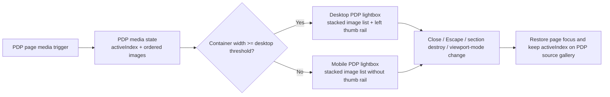

# feat: Recreate Huckberry PDP lightbox

## Overview

Rework the PDP buy box media viewer to match the Huckberry product lightbox interaction observed on April 22, 2026.

The implementation should stop treating the PDP as a generic slideshow plus generic collection lightbox. Instead, it should use a PDP-specific viewer with one shared stacked-image interaction and two responsive presentations:

- Desktop: a full-surface white lightbox with a left-side vertical thumbnail rail, a vertically scrollable image stack, keyboard left/right stepping between images, and explicit close affordances.
- Mobile: a white modal that shows the same vertically scrollable image stack, with the tapped image scrolled into view and no thumbnail rail or arrow chrome.

The work should preserve the repo's contained-overlay constraints and keep the generic `src/image.lightbox.ts` behavior intact for the existing gallery and single-image sections.

## Problem Frame

The current PDP prototype in `src/pdp-buy-box.ts` reuses the generic gallery slideshow and the generic `initImageLightbox()` controller. That is a reasonable reuse story, but it does not match Huckberry's product-image behavior:

- The current prototype opens a gallery-style collection lightbox with explicit previous/next buttons and a counter.
- Huckberry desktop opens a cleaner white viewer with no visible previous/next buttons, a left thumbnail rail, and a vertically scrollable image stack.
- Huckberry mobile does not use the same collection chrome at all; it opens the same stacked image model inside a rail-less modal surface.

The mismatch is structural, not cosmetic. A single shared gallery lightbox mode will keep producing the wrong interaction model for the PDP even if the styling is adjusted.

This repo also has a hard local constraint: overlays must stay inside the preview container, not the browser top layer. The implementation therefore needs to emulate a full-page product lightbox while remaining absolutely positioned and container-aware inside the prototype shell.

## Requirements Trace

- R1. Clicking a PDP media image opens a contained lightbox inside the preview shell.
- R2. Desktop lightbox behavior matches the observed Huckberry desktop pattern: white overlay, vertically scrollable image stack, left thumbnail rail, close button, `Escape` close, and keyboard left/right image stepping.
- R3. Mobile lightbox behavior matches the observed Huckberry mobile pattern: white modal, close button, vertically scrollable stack of images, and no desktop-only thumbnail rail or previous/next chrome.
- R4. Opening the lightbox preserves the tapped image as the initial active image on both desktop and mobile.
- R5. Responsive mode selection follows the simulated preview/container width, not the host browser window, so the shell's viewport switcher remains authoritative.
- R6. Product switches, section switches, viewport changes, and destroy paths cleanly tear down any open PDP lightbox without leaking listeners or leaving inert state behind.
- R7. The generic gallery/single-image lightbox implementation remains unchanged in behavior unless this plan explicitly touches shared utilities.
- R8. Playwright coverage proves the desktop/mobile split, close behavior, active-image continuity, and cleanup cases.

## Scope Boundaries

- Do not attempt to fully recreate Huckberry's entire PDP layout, top navigation, chat widget, or cart drawer. This plan focuses on the product-media lightbox experience and the minimum source-gallery changes needed to support it.
- Do not retrofit the Huckberry PDP lightbox behavior into the generic `src/gallery.section.ts` or `src/single-image.section.ts` flows.
- Do not add pinch zoom, drag-to-pan, or inertia-heavy gesture handling in this pass.
- Do not introduce a third-party lightbox dependency.

### Deferred to Separate Tasks

- Recreating Huckberry's exact on-page desktop media grid beneath the hero image, beyond what is needed to support the lightbox entry point.
- Reworking the rest of the PDP information architecture to mirror Huckberry more precisely.
- Adding motion tuning beyond a simple open/close transition that fits the contained preview shell.

## Context & Research

### Relevant Code and Patterns

- `src/pdp-buy-box.ts` currently builds PDP media items, wires `initSlideshow()`, and pipes image clicks into the shared `initImageLightbox()` flow.
- `src/pdp-buy-box.partial.html` already isolates the media surface in `.pdp-buy-box__media`, which is the natural host for a PDP-specific source gallery and lightbox trigger contract.
- `src/pdp-buy-box.css` already defines the PDP layout breakpoints and is the correct place to anchor the source gallery behavior; the lightbox surface itself should live in a dedicated PDP-specific stylesheet.
- `src/image.lightbox.ts` contains useful patterns for contained overlay positioning, focus restoration, viewport-change syncing, and cleanup sequencing, but its single-image/collection model does not match Huckberry's stacked-scroll PDP behavior.
- `src/gallery.slideshow.ts` is tightly oriented around looped carousel browsing. That is a poor fit for Huckberry's desktop thumb-synced stack and an even worse fit for the mobile stacked modal.
- `src/pdp-buy-box.section.ts` and `src/shell.ts` already provide the right lifecycle seams for closing the viewer during section switches and preview-width changes.

### Institutional Learnings

- `docs/solutions/ui-bugs/fixed-overlay-containment-preview.md` is directly applicable: do not use `position: fixed` or `showModal()` inside the preview shell.
- `docs/solutions/ui-bugs/flip-animation-origin-lightbox.md` is relevant if this work adds or retains open/close transitions; any measurement must happen before layout mutations and must respect image geometry.

### External References

- Live Huckberry observation on 2026-04-22: `https://huckberry.com/store/proof/category/p/83483-equator-short-7`

### Observed Huckberry Behavior (2026-04-22)

- Desktop:
  - Clicking the hero image opens a white full-page viewer.
  - A left-side vertical thumbnail rail shows a subset of the image set with up/down overflow chevrons.
  - The main content is a vertically scrollable image stack rather than a single-image carousel.
  - Clicking a thumbnail scrolls the corresponding image into view and updates the selected thumbnail state.
  - The viewer exposes a close button in the top-right corner.
  - Keyboard `ArrowRight` and `ArrowLeft` step between adjacent images in the stack.
  - `Escape` closes the viewer and returns to the PDP.
  - No always-visible previous/next arrow buttons or text counter were observed.

- Mobile:
  - Clicking the hero image opens a white modal-style viewer with a close button in the top-right corner.
  - The image set is presented as a vertically scrollable stack rather than a thumb rail or arrow-driven carousel.
  - The tapped image appears first, and browsing proceeds by vertical scrolling inside the modal.
  - No thumbnail rail, counter, or previous/next arrow chrome was observed.

## Key Technical Decisions

- Build a PDP-specific lightbox controller instead of mutating `src/image.lightbox.ts`.
Rationale: the existing generic lightbox powers other sections successfully, but Huckberry's PDP behavior is a two-mode product viewer, not a reusable gallery collection overlay.

- Replace the PDP's slideshow-centric media state with a stable active-image model that both the page and the lightbox can consume.
Rationale: cloned loop slides and pagination logic from `src/gallery.slideshow.ts` create the wrong mental model for a thumb-synced desktop stack and for a stacked mobile modal.

- Choose desktop vs mobile lightbox mode from the simulated preview/container width, not `window.innerWidth`.
Rationale: this prototype runs inside a shell with artificial viewport sizes. The viewer must respond to the section's effective viewport, not the real browser window.

- Close the PDP lightbox when the responsive mode boundary changes instead of hot-swapping an open desktop thumb-rail stack into a mobile rail-less modal.
Rationale: the two modes share the same image ordering, but their chrome, layout, and focus targets differ. Closing on mode change is simpler, easier to test, and less likely to leak focus or scroll state. The page should preserve the active image index so reopening remains predictable.

- Keep the Huckberry-specific viewer white and image-first, with no shared gallery counter or previous/next buttons.
Rationale: those controls are part of the generic gallery lightbox, but they were not present in the observed Huckberry experience.

- Use a vertically scrollable image stack as the core viewer interaction in both modes, with desktop adding a thumbnail rail and keyboard stepping.
Rationale: this matches the observed desktop and mobile behavior on the live site more closely than a carousel model does.

- Keep the overlay fully contained to the section/preview shell.
Rationale: the repo's preview-container architecture forbids top-layer behavior even when the target site uses a true browser-viewport lightbox.

## Open Questions

### Resolved During Planning

- Should this reuse the generic `src/image.lightbox.ts` controller? No; the PDP needs a dedicated viewer.
- Should desktop keep previous/next arrow buttons and counters? No; the viewer should rely on the thumb rail plus keyboard stepping and scroll position.
- Should mobile reuse the same single-image carousel structure as desktop? No; both modes should use a stacked scroll model, with mobile dropping the desktop rail chrome.
- Should the responsive split use real browser width? No; it should use the prototype's simulated viewport/container width.
- Should the viewer survive a desktop/mobile breakpoint change while open? No; close and preserve source state instead.

### Deferred to Implementation

- Exact desktop/mobile breakpoint value. Default assumption if unanswered: align with the PDP layout breakpoint already used to move from stacked to two-column layout, then fine-tune if the viewer looks wrong at the shell's tablet width.
- Whether the desktop thumb rail needs animated scroll buttons or simple instant step scrolling. Default assumption if unanswered: instant step scrolling is sufficient.
- Whether the mobile stacked viewer should use optional `scroll-snap-type: y proximity`. Default assumption if unanswered: no forced snap; use natural scrolling and scroll the tapped image into view on open.
- Whether the source PDP page gallery should exactly match Huckberry's on-page thumbnail arrangement or remain a prototype-friendly approximation. Default assumption if unanswered: keep source-page layout changes minimal and focus on lightbox fidelity.

## High-Level Technical Design

> *This illustrates the intended approach and is directional guidance for review, not implementation specification. The implementing agent should treat it as context, not code to reproduce.*

## Implementation Units

- [ ] **Unit 1: Replace slideshow-centric PDP media state with a stable source gallery**

**Goal:** Make the PDP media surface own a deterministic active-image index and ordered image list that can feed both the page gallery and the Huckberry-style lightbox.

**Requirements:** R1, R4, R5, R6, R7

**Dependencies:** None

**Files:**
- Create: `src/pdp-buy-box.media.ts`
- Modify: `src/pdp-buy-box.ts`
- Modify: `src/pdp-buy-box.partial.html`
- Modify: `src/pdp-buy-box.css`
- Test: `tests/pdp-buy-box.spec.ts`

**Approach:**
- Remove PDP dependence on `initSlideshow()` as the source of truth for image state.
- Introduce a small PDP media controller that exposes ordered image metadata, active index, source trigger wiring, and page-level selection updates.
- Keep the page media surface prototype-friendly, but ensure the active image is explicit and shareable with the lightbox instead of being buried inside a carousel instance.
- Preserve `data-lightbox="true"` as the prototype toggle for enabling/disabling the viewer.

**Patterns to follow:**
- `src/pdp-buy-box.ts`
- `src/gallery.controls.ts` for data-driven rebuilds
- `src/image.targets.ts` for consistent image metadata resolution where helpful

**Test scenarios:**
- Happy path: clicking a PDP source thumbnail updates the active page image and selected state.
- Happy path: switching products resets the active image to the first image of the new product and rebuilds the source gallery.
- Edge case: disabling the lightbox keeps source-gallery image switching working without opening an overlay.
- Edge case: remounting the section restores the selected product and leaves the PDP media surface in a valid first-image state.

**Verification:**
- The PDP page exposes a stable active image independent of the generic slideshow module, and product changes no longer rely on carousel clones to determine which image is current.

- [ ] **Unit 2: Build the desktop Huckberry-style PDP lightbox**

**Goal:** Implement the observed desktop viewer: white overlay, vertically scrollable image stack, left thumbnail rail, keyboard left/right stepping, and explicit close behavior.

**Requirements:** R1, R2, R4, R5, R6, R7

**Dependencies:** Unit 1

**Files:**
- Create: `src/pdp-buy-box.lightbox.ts`
- Create: `src/pdp-buy-box.lightbox.css`
- Modify: `src/pdp-buy-box.ts`
- Modify: `src/main.css`
- Test: `tests/pdp-buy-box-lightbox.spec.ts`

**Approach:**
- Add a PDP-specific lightbox host appended to the PDP root or other contained overlay host inside the preview shell.
- Render the ordered PDP image set in DOM order as a vertically scrollable desktop stack, alongside a left-side rail of thumbnails tied to the same image list.
- Support close via close button and `Escape`, plus keyboard `ArrowLeft` / `ArrowRight` stepping that scrolls the previous or next image into view.
- Add simple rail overflow controls when the product has more thumbnails than the visible rail can show.
- Restore focus to the source trigger on close and clean up immediately on section destroy or product swap.

**Execution note:** Start with failing desktop integration coverage for open, navigate, and close behavior before replacing the current generic-lightbox hookup.

**Patterns to follow:**
- `src/image.lightbox.ts` for contained-overlay cleanup, focus return, and viewport syncing
- `docs/solutions/ui-bugs/fixed-overlay-containment-preview.md`
- `docs/solutions/ui-bugs/flip-animation-origin-lightbox.md`

**Test scenarios:**
- Happy path: clicking the PDP hero image opens the desktop lightbox with the corresponding image scrolled into view.
- Happy path: clicking a lightbox thumbnail scrolls to the matching stacked image and updates the selected thumb state.
- Happy path: pressing `ArrowRight` advances to the next image, and `ArrowLeft` returns to the previous image.
- Happy path: clicking the close button or pressing `Escape` closes the viewer and returns focus to the source image trigger.
- Edge case: products with more images than the visible rail can show expose working rail-scroll controls without changing the active image unexpectedly.
- Edge case: opening from a non-first image keeps that image active on first render instead of resetting to image 1.
- Error path: if an image fails to decode, the viewer stays open and preserves functional close/navigation controls rather than tearing down the entire PDP.
- Integration: switching the PDP product while the desktop lightbox is open closes the viewer and rebuilds against the new product's image list.

**Verification:**
- Desktop PDP lightbox behavior matches the observed Huckberry pattern, including stacked scrolling plus thumb-rail sync, and no longer displays the generic gallery counter or previous/next buttons.

- [ ] **Unit 3: Add the mobile stacked-image modal mode**

**Goal:** Implement the observed mobile viewer: white modal, close button, and a vertically scrollable image stack with the tapped image brought into view.

**Requirements:** R1, R3, R4, R5, R6, R8

**Dependencies:** Units 1 and 2

**Files:**
- Modify: `src/pdp-buy-box.lightbox.ts`
- Modify: `src/pdp-buy-box.lightbox.css`
- Modify: `src/pdp-buy-box.ts`
- Test: `tests/pdp-buy-box-lightbox.spec.ts`

**Approach:**
- Add a second rendering path inside the PDP-specific lightbox for narrow containers.
- Render all images in DOM order as a vertically scrollable list inside the mobile modal instead of using a thumb rail or carousel.
- On open, scroll the tapped image into view so the user lands on the image they chose from the PDP.
- Keep the close button pinned and omit desktop-only chrome such as rail controls, counters, and left/right navigation buttons.

**Patterns to follow:**
- `src/pdp-buy-box.css` responsive layout breakpoints
- `src/image.lightbox.ts` for contained scroll-lock/focus patterns where they still apply

**Test scenarios:**
- Happy path: at mobile viewport width, clicking the PDP hero image opens the mobile lightbox instead of the desktop thumb-rail viewer.
- Happy path: the mobile modal contains the ordered image stack, and scrolling inside it reveals later images without closing the viewer.
- Happy path: opening from a later source image scrolls that image into view on first render.
- Edge case: mobile mode does not render desktop-only rail controls, previous/next buttons, or counters.
- Edge case: the mobile close button dismisses the viewer and returns to the PDP without leaving the page scrolled into an invalid position.
- Integration: the same ordered image list powers both desktop and mobile modes, so switching viewport size while closed preserves which page image is currently active.

**Verification:**
- Narrow simulated viewports show a stacked, scroll-driven image modal that matches the observed Huckberry mobile experience.

- [ ] **Unit 4: Harden responsive switching, shell cleanup, and regression coverage**

**Goal:** Ensure the PDP lightbox behaves predictably across viewport switches, section switches, and existing prototype controls.

**Requirements:** R5, R6, R7, R8

**Dependencies:** Units 1-3

**Files:**
- Modify: `src/pdp-buy-box.section.ts`
- Modify: `src/pdp-buy-box.ts`
- Modify: `tests/pdp-buy-box.spec.ts`
- Modify: `tests/shell-switching.spec.ts`
- Modify: `tests/pdp-buy-box-lightbox.spec.ts`

**Approach:**
- Close the viewer when the PDP crosses the desktop/mobile mode boundary or when the shell switches sections.
- Preserve the page-level active image index so reopening after a close lands on the same source image.
- Keep PDP-specific behavior isolated so existing gallery and single-image lightbox tests remain unchanged unless a shared helper truly needs to move.
- Make the test matrix cover both viewport families explicitly rather than relying on desktop-only expectations.

**Patterns to follow:**
- `src/pdp-buy-box.section.ts`
- `src/shell.ts`
- `tests/shell-switching.spec.ts`

**Test scenarios:**
- Happy path: switching from desktop to mobile viewport while the lightbox is closed preserves the current page image and changes the next-open mode.
- Edge case: switching viewport modes while the lightbox is open closes it cleanly and leaves the page in a usable state.
- Edge case: switching away from the PDP section while the lightbox is open destroys the viewer and does not leak overlay DOM into the next section.
- Edge case: turning the lightbox control off prevents open behavior in both desktop and mobile modes.
- Integration: existing generic gallery and single-image lightbox tests continue to pass without inheriting PDP-specific UI assumptions.

**Verification:**
- The PDP viewer is mode-aware, shell-safe, and isolated from the generic lightbox flows already covered elsewhere in the repo.

## System-Wide Impact

- **Interaction graph:** `src/pdp-buy-box.section.ts` initializes the PDP section, `src/pdp-buy-box.ts` owns product/media state, and the new PDP-specific lightbox module consumes that media state without passing through `src/gallery.slideshow.ts`.
- **Error propagation:** image decode or render failures should stay local to the PDP lightbox and leave close/cleanup behavior functional.
- **State lifecycle risks:** active image index, product changes, viewport-mode changes, and section teardown all need one authoritative cleanup path.
- **API surface parity:** the PDP should continue honoring the existing `data-lightbox` toggle and current product-switch controls even though its viewer stops using the generic lightbox.
- **Integration coverage:** desktop open/navigate/close, mobile open/scroll/close, product switch while open, and shell section switching are the essential cross-layer cases.
- **Unchanged invariants:** the existing `src/image.lightbox.ts` behavior for gallery and single-image sections remains unchanged; this plan does not re-scope the whole repo around Huckberry-specific lightbox behavior.

## Risks & Dependencies

| Risk | Mitigation |
|------|------------|
| Desktop/mobile mode detection uses the wrong width source and behaves inconsistently inside the shell | Base mode selection on the contained preview/container width, not the host browser viewport |
| PDP lightbox logic leaks into generic gallery behavior | Keep the new viewer in PDP-specific modules and avoid changing `src/image.lightbox.ts` unless a clearly reusable helper must move |
| Open overlay persists across product/section switches | Centralize close/cleanup in the PDP section lifecycle and add explicit regression tests |
| Desktop or mobile lightbox is implemented as another carousel by habit | Treat the live Huckberry stacked-scroll behavior as the contract and encode it directly in tests |

## Documentation / Operational Notes

- If this work lands, the earlier generic PDP gallery plan in `docs/plans/2026-04-22-002-feat-pdp-image-gallery-plan.md` should be treated as superseded wherever it assumes the generic slideshow + generic lightbox combination remains the intended end state.
- The live Huckberry interaction should be revalidated if a later implementation pass happens long after 2026-04-22, since this is behavior research against a third-party site.

## Sources & References

- Live site observation: `https://huckberry.com/store/proof/category/p/83483-equator-short-7`
- Related plans: `docs/plans/2026-04-17-001-feat-image-lightbox-zoom-plan.md`, `docs/plans/2026-04-22-002-feat-pdp-image-gallery-plan.md`
- Related code: `src/pdp-buy-box.ts`, `src/pdp-buy-box.partial.html`, `src/pdp-buy-box.css`, `src/image.lightbox.ts`, `src/gallery.slideshow.ts`
- Related learnings: `docs/solutions/ui-bugs/fixed-overlay-containment-preview.md`, `docs/solutions/ui-bugs/flip-animation-origin-lightbox.md`
