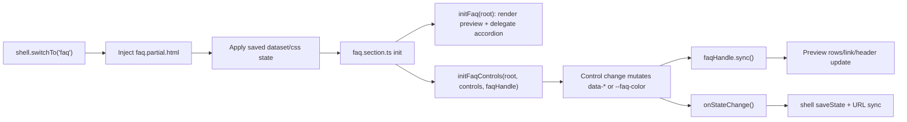

# feat: Add configurable FAQ section

## Overview

Add a new `FAQ` section to the prototype shell. The section will ship with 10 seeded storefront FAQ entries, shared background/content width controls, configurable heading/subheading, list and card layouts, optional “See More FAQs” link, and accordion behavior that defaults to the Family-style list reference.

---

## Problem Frame

Storefront builders need a reusable FAQ section that answers common buyer questions while staying visually flexible. The section should feel like a peer of the existing nav, gallery, single-image, and PDP sections: manually wired DOM, data-attribute-driven state, shared width controls, visual thumbnail controls, and full mount/unmount lifecycle. (see origin: `docs/brainstorms/2026-04-24-faq-section-requirements.md`)

---

## Requirements Trace

- R1. Configurable heading, subheading, background color, and 10 seeded question/answer pairs
- R2. Shared background width and content width controls using `full`/`hug` and `full`/`wide`/`medium`/`narrow`
- R3. Heading/subheading placement above or beside the FAQ items, with narrow viewport stacking
- R4. Control for visible FAQ count from 1 through 10
- R5. Optional “See more FAQs” link with editable label and URL
- R6. Two layouts: `list` and `cards`
- R7. Thumbnail-style controls for layout, heading placement, and indicator style
- R8. Family-inspired list accordion: heading column, FAQ column, thin dividers, compact rows, left indicator, indented answers, link below list
- R9. Card layout presents each FAQ as an individual card while preserving content and behavior controls
- R10. Accordion defaults to on
- R11. Accordion answers are collapsed by default and expand/collapse independently
- R12. Accordion off shows all visible answers statically and removes accordion interactivity
- R13. Indicator style can be `chevrons` or `plus`; chevrons rotate, plus becomes minus
- R14. Accordion interaction exposes state, supports keyboard activation, and keeps focus on the invoked question
- R15. FAQ controls persist through section switching
- R16. FAQ destroy tears down event listeners; restore applies state before controls initialize

**Origin actors:** A1 (Storefront designer), A2 (Shopper)
**Origin flows:** F1 (Configure FAQ layout), F2 (Read FAQ answers)
**Origin acceptance examples:** AE1 (width and placement), AE2 (visible count), AE3 (plus-to-minus accordion), AE4 (accordion off), AE5 (editable link)

---

## Scope Boundaries

- FAQ question/answer editing, reordering, adding custom FAQ items, and deleting individual FAQ items stay out of scope.
- Rich text answers, images inside answers, nested accordions, categories/groups, and external FAQ data sources stay out of scope.
- The “See more FAQs” link is a normal preview link, not page-builder routing or a managed FAQ page.
- The Family reference applies to the `list` layout only. `cards` should be complementary, not a Family clone.
- Open/closed accordion state is ephemeral preview state and should not persist through section switching or URL serialization.

---

## Context & Research

### Relevant Code and Patterns

- `src/shell.ts` restores saved `data-*` and `css:` state before `init()` runs, then calls each section's `saveState()` on section switch and URL updates.
- `src/gallery.section.ts` and `src/single-image.section.ts` show the expected section wrapper shape: raw partial import, root lookup, controls init, `destroy()`, generic dataset save, and CSS custom property save.
- `src/section-width.ts` and `src/section-width.css` define the shared width schema and `.sw-bg` / `.sw-body` placement that FAQ should reuse.
- `src/gallery.controls.ts`, `src/single-image.controls.ts`, and `src/pdp-buy-box.controls.ts` show control-panel patterns: `createSegmentedGroup`, `createStepperGroup`, local color swatch builders, and local `variant-thumb` thumbnail pickers.
- `src/controls.css` already styles `control-group--style`, `variant-thumb`, layout thumbnail grids, shape thumbnail grids, segmented controls, steppers, and swatches.
- `src/nav.ts` and `src/pdp-buy-box.css` show existing accordion-adjacent patterns: `aria-expanded` state, plus/chevron transformations, and `AbortController` cleanup.
- `tests/shell-switching.spec.ts`, `tests/nav-accessibility.spec.ts`, and `tests/helpers.ts` provide Playwright patterns for picker options, control state, keyboard/accessibility checks, section switching, URL state, and radio/stepper manipulation.

### Institutional Learnings

- `docs/solutions/ui-bugs/fixed-overlay-containment-preview.md`: keep interactive surfaces contained in `#preview-root`; FAQ does not need overlays, but the same rule means no `position: fixed` or global document-level UI.
- `docs/plans/2026-04-23-003-feat-single-image-mask-shapes-plan.md`: prefer existing `variant-thumb` controls and generic dataset serialization over inventing new control abstractions.

### External References

- Family homepage FAQ reference: https://family.co/ (captured in the origin document as checked on 2026-04-24)

---

## Key Technical Decisions

- **Default state mirrors the Family reference:** `layout=list`, `headingPlacement=beside`, `accordion=true`, `indicator=plus`, visible count `3`, and link enabled with label “See More FAQs”. The origin references the Family homepage specifically, and this default makes the first preview demonstrate that target.
- **FAQ preview module owns rendering:** Add a small `src/faq.ts` handle that reads root dataset state, renders seeded FAQ rows, and owns accordion event delegation. Controls mutate dataset and ask the preview handle to resync. This keeps accordion-off mode semantically static instead of leaving disabled accordion buttons in the DOM.
- **Seed content in a small data module:** Put the 10 question/answer pairs in `src/faq.data.ts`. This avoids repeating content across partial, controls, and tests while staying consistent with the PDP data-file pattern.
- **No new shared control abstraction:** Build FAQ thumbnail groups locally using the existing `variant-thumb` markup and `controls.css` classes. This keeps the feature scoped and avoids premature extraction.
- **Use custom accordion buttons instead of native `
`:** Native `
` would make accordion-off mode awkward because `
` stays interactive. Rendering button rows only when accordion mode is on satisfies R12 and gives direct control over `aria-expanded`, focus, and indicators.
- **Multiple-open accordion:** Each FAQ opens and closes independently. The origin listed this as the default assumption, and it avoids extra one-open-at-a-time state machinery.
- **Only persist configuration, not ephemeral open rows:** Save dataset and background CSS props, but not which answers are currently open. Switching sections restores the configured FAQ, with answers collapsed when accordion mode is on.

---

## Open Questions

### Resolved During Planning

- **Family-like visual spacing:** Use the Family visual ingredients as the target: large heading column, right FAQ column, thin dividers, compact rows, red/orange left indicator, indented answer copy, and link below the rows. Exact pixel values are implementation tuning inside `src/faq.css`.
- **Accordion grouping:** Allow multiple answers to be open independently.
- **Default visible count:** Default to 3 visible FAQs to match the Family reference, while preserving the full 1-10 control range.
- **Accordion-off semantics:** Render non-interactive question/answer blocks when accordion is off rather than leaving accordion buttons disabled.

### Deferred to Implementation

- **Final typography and spacing values:** Tune in CSS against the preview at 375, 768, and 1280 widths, preserving no-overlap and readable wrapping.

---

## High-Level Technical Design

> *This illustrates the intended approach and is directional guidance for review, not implementation specification. The implementing agent should treat it as context, not code to reproduce.*

FAQ rendering is driven by root state:

| State input | Preview effect |
|---|---|
| `data-count` | Renders the first N seeded FAQ items |
| `data-accordion="true"` | Renders question buttons with collapsed answer panels and `aria-expanded` |
| `data-accordion="false"` | Renders static question headings and visible answers |
| `data-indicator="plus"` | Shows plus/minus indicator state |
| `data-indicator="chevron"` | Shows chevron with open-state rotation |
| `data-layout="list"` | Family-like rows with dividers |
| `data-layout="cards"` | Individual FAQ cards |
| `data-heading-placement` | Positions heading/subheading above or beside the FAQ items |

---

## Implementation Units

- [x] U1. **Scaffold the FAQ section and seeded preview**

**Goal:** Add the FAQ section shell, seeded FAQ content, default DOM structure, preview rendering handle, section registration, and generic state persistence.

**Requirements:** R1, R2, R3, R4, R5, R6, R10, R11, R12, R15, R16; F1; AE2

**Dependencies:** None

**Files:**
- Create: `src/faq.data.ts`
- Create: `src/faq.partial.html`
- Create: `src/faq.ts`
- Create: `src/faq.section.ts`
- Create: `src/faq.css`
- Modify: `src/main.ts`
- Modify: `src/main.css`
- Test: `tests/shell-switching.spec.ts`
- Test: `tests/faq-section.spec.ts`

**Approach:**
- Add the 10 seeded FAQ entries from the origin document to `src/faq.data.ts`.
- Create `src/faq.partial.html` with a `.faq` root carrying default data attributes: list layout, beside heading placement, accordion on, plus indicator, count 3, link enabled, default heading “Frequently Asked Questions”, empty subheading, shared width defaults, and `--faq-color`.
- Include `.faq__bg.sw-bg` and `.faq__body.sw-body` so the shared section width system applies without special casing.
- Add `src/faq.ts` as the preview handle. It should render heading/subheading/link and the first `data-count` FAQ items from the seed data, with rendering branches for accordion on/off.
- Add `src/faq.section.ts` using the gallery/single-image section wrapper pattern: root lookup, preview handle init, controls init in a later unit, `destroy()`, generic dataset save, and `css:--faq-color` save.
- Register the FAQ section in `src/main.ts` and import `src/faq.css` in `src/main.css`.

**Patterns to follow:**
- `src/gallery.section.ts` for section wrapper and generic dataset/CSS state persistence.
- `src/single-image.partial.html` and `src/gallery.partial.html` for `.sw-bg` / `.sw-body` structure.
- `src/pdp-buy-box.data.ts` for separating seeded data when content is reused by rendering behavior.

**Test scenarios:**
- Happy path: selecting `faq` in `.controls__picker` unmounts the previous section and renders one `.faq` root.
- Happy path: picker options include `FAQ` in addition to the existing four sections.
- Happy path: default FAQ state has `data-layout="list"`, `data-heading-placement="beside"`, `data-accordion="true"`, `data-indicator="plus"`, and `data-count="3"`.
- Covers AE2. Happy path: with default count 3, exactly three FAQ items are rendered even though 10 seed entries exist.

**Verification:**
- FAQ mounts from the shell picker, renders seeded content, preserves shared width structure, and serializes/restores root dataset plus `--faq-color`.

---

- [x] U2. **Build FAQ controls and state synchronization**

**Goal:** Add controls for layout, width, heading/subheading, heading placement, visible count, accordion mode, indicator style, background color, and the optional “See More FAQs” link.

**Requirements:** R1, R2, R3, R4, R5, R6, R7, R10, R13, R15; F1; AE1, AE2, AE5

**Dependencies:** U1

**Files:**
- Create: `src/faq.controls.ts`
- Modify: `src/faq.section.ts`
- Modify: `src/faq.ts`
- Test: `tests/faq-section.spec.ts`
- Test: `tests/shell-switching.spec.ts`

**Approach:**
- Add `initFaqControls(root, container, previewHandle, onStateChange)` that mirrors existing control modules: local `AbortController`, wrapper `.controls`, local helpers, append controls, cleanup removes wrapper.
- Use local `variant-thumb` groups for:
  - Layout: `list` vs `cards`
  - Heading placement: `above` vs `beside`
  - Indicator: `plus` vs `chevrons`
- Use shared builders for:
  - Background width (`BG_WIDTHS`, `BG_WIDTH_LABELS`)
  - Content width (`CONTENT_WIDTHS`, `CONTENT_WIDTH_LABELS`)
  - Visible FAQ count stepper (`1..10`)
  - Accordion on/off segmented control
  - Link enabled on/off segmented control
- Add text inputs for heading, subheading, link label, and link URL. Hide link label/URL controls when link is off, following the gallery hidden-controls pattern.
- Add a local background color swatch group mirroring gallery/single-image, writing `--faq-color`.
- On every control change, set the root dataset or CSS custom property, call the preview handle sync method, then call `onStateChange()`.

**Patterns to follow:**
- `src/gallery.controls.ts` for layout thumbnail controls, width controls, count stepper, heading/subheading inputs, color swatches, and control visibility sync.
- `src/pdp-buy-box.controls.ts` for passing a preview handle into controls and calling sync methods after dataset changes.
- `src/control-builders.ts` for steppers and segmented controls.

**Test scenarios:**
- Covers AE1. Happy path: changing `bgWidth` to `hug`, `contentWidth` to `medium`, and heading placement to `beside` updates the FAQ root attributes and keeps the heading/questions in the shared grid.
- Covers AE2. Happy path: changing the count stepper to 4 updates `data-count="4"` and renders four FAQ items.
- Happy path: layout thumbnail selection updates `data-layout` from `list` to `cards`.
- Happy path: heading and subheading inputs update `data-heading`, `data-subheading`, and visible text.
- Covers AE5. Happy path: turning the link on, editing label to “View all questions”, and editing URL to `/faq` updates the rendered link text and `href`.
- Edge case: turning the link off removes the rendered link and hides link label/URL controls.
- Integration: after changing layout, heading placement, count, link, and background color, switching away and back restores checked controls and preview state.

**Verification:**
- Every FAQ configuration control updates preview state immediately and persists through the shell state cycle.

---

- [x] U3. **Implement accordion/static behavior and accessibility**

**Goal:** Make FAQ answers expand/collapse accessibly when accordion mode is on, render static non-interactive answers when off, and support both indicator styles.

**Requirements:** R8, R9, R10, R11, R12, R13, R14, R16; F2; AE3, AE4

**Dependencies:** U1, U2

**Files:**
- Modify: `src/faq.ts`
- Modify: `src/faq.css`
- Test: `tests/faq-section.spec.ts`
- Test: `tests/nav-accessibility.spec.ts`

**Approach:**
- In accordion mode, render each FAQ question as a real `<button>` with `aria-expanded`, `aria-controls`, stable answer `id`, and answer panel hidden until opened.
- Use event delegation scoped to the FAQ root with `{ signal }` cleanup. On click, toggle only the invoked item and keep focus on the button. Native button keyboard handling covers Enter/Space.
- Track open state in memory only for the mounted FAQ instance. Reset open state when count, layout, or accordion mode changes.
- Render indicators as `aria-hidden` elements whose visual state is derived from row open state and `data-indicator`. Do not expose plus/minus or chevron glyphs as extra accessible names.
- In accordion-off mode, render static question headings plus visible answers without accordion buttons or `aria-expanded`.
- Ensure controls cleanup aborts all FAQ event listeners on section destroy.

**Patterns to follow:**
- `src/nav.ts` for scoped `aria-expanded` updates and `AbortController` event cleanup.
- `src/nav.css` for plus/chevron open-state transforms.
- `tests/nav-accessibility.spec.ts` for focus, Escape/keyboard, and accessibility-state testing style.

**Test scenarios:**
- Covers AE3. Happy path: with accordion on and plus indicator selected, clicking the first question reveals its answer, keeps focus on the question button, changes `aria-expanded` to `true`, and visually exposes the minus state.
- Happy path: clicking the same open question again hides the answer and returns `aria-expanded` to `false`.
- Happy path: with chevron indicator selected, opening a question applies the open-state rotation class/attribute without changing the accessible question name.
- Edge case: opening question 1 and question 2 leaves both open, proving independent expansion.
- Covers AE4. Happy path: with accordion off, all visible answers are shown, no FAQ question exposes `aria-expanded`, and clicking question text does not collapse content.
- Integration: after switching away from an FAQ with open answers and returning, accordion mode is restored but answers are collapsed by default.

**Verification:**
- Accordion interactions are accessible, localized to the FAQ section, cleaned up on destroy, and semantically removed when accordion mode is off.

---

- [x] U4. **Style list, cards, and responsive layout**

**Goal:** Implement the Family-inspired list presentation, card presentation, heading placement behavior, shared background/body visuals, and responsive rules.

**Requirements:** R2, R3, R5, R6, R8, R9, R13; F1, F2; AE1, AE5

**Dependencies:** U1, U2, U3

**Files:**
- Modify: `src/faq.css`
- Test: `tests/faq-section.spec.ts`

**Approach:**
- Use `.faq` as a named container and keep all layout driven by root data attributes.
- Apply `--faq-color` to `.faq__bg`, and to `.faq__body` in `data-bg-width="hug"` mode, matching gallery and single-image.
- In list layout:
  - Use a large, compact-line-height heading block.
  - Place heading and questions side-by-side at wider preview widths for `data-heading-placement="beside"`.
  - Stack heading above questions for `data-heading-placement="above"` and for narrow preview widths.
  - Style FAQ rows with thin top/bottom dividers, left red indicator, question text, indented answer copy, and link below the list.
- In card layout:
  - Use a responsive card grid or single-column stack depending on preview width and content width.
  - Preserve the same accordion/static answer behavior inside each card.
  - Keep card radius at 8px or less, in line with the project design guidance.

**Patterns to follow:**
- `src/gallery.css` for background/body handling, container queries, and data-attribute layout selectors.
- `src/pdp-buy-box.css` for divider-based accordion styling.
- `src/controls.css` for existing `variant-thumb` thumbnail sizing and selected/focus states.

**Test scenarios:**
- Covers AE1. Happy path: at a 1280 preview width with heading placement `beside`, heading and FAQ rows occupy separate horizontal regions.
- Edge case: at a 375 preview width with heading placement `beside`, heading stacks above FAQ rows and text does not overlap.
- Happy path: switching to `cards` renders the same visible FAQ count as individual cards.
- Happy path: with link enabled, the link appears below the FAQ rows/cards with the configured label.
- Edge case: long seeded questions wrap inside row/card bounds without changing control dimensions or overlapping indicators.

**Verification:**
- The FAQ section visually reads as Family-inspired in list mode, stays responsive inside the preview widths, and uses the shared width/background behavior consistently.

---

- [x] U5. **Complete FAQ e2e coverage and regression updates**

**Goal:** Add focused FAQ e2e coverage and update existing shell tests for the new picker option.

**Requirements:** R1-R16; F1, F2; AE1-AE5

**Dependencies:** U1, U2, U3, U4

**Files:**
- Create: `tests/faq-section.spec.ts`
- Modify: `tests/shell-switching.spec.ts`
- Modify: `tests/nav-accessibility.spec.ts`

**Approach:**
- Keep FAQ-specific behavior in `tests/faq-section.spec.ts`.
- Update picker option expectations in `tests/shell-switching.spec.ts` from four sections to five sections.
- Add any cross-section lifecycle checks in `tests/shell-switching.spec.ts` only when they exercise shell state, not FAQ internals.
- Add accessibility-focused accordion checks either in `tests/faq-section.spec.ts` or a small FAQ block in `tests/nav-accessibility.spec.ts`; avoid duplicating the same interaction assertions in both files.

**Patterns to follow:**
- `tests/helpers.ts` for `checkRadio()` and existing control manipulation helpers.
- Existing width-control, URL-serialization, and controls-restore tests in `tests/shell-switching.spec.ts`.
- Existing accessibility tests in `tests/nav-accessibility.spec.ts`.

**Test scenarios:**
- Happy path: FAQ appears in the picker with the expected label and can be selected.
- Happy path: all primary controls update root attributes and visible preview state.
- Covers AE1-AE5. Integration: width/placement, count, accordion, accordion-off, and link behavior are all tested at least once.
- Edge case: URL serialization includes FAQ state keys after changing layout, count, link, and width controls.
- Edge case: restoring a URL with FAQ state applies dataset/CSS state before controls initialize, so controls and preview agree immediately.
- Cleanup: switching away after opening FAQ answers removes `.faq` from the DOM and switching back does not retain stale open rows or duplicate listeners.

**Verification:**
- The new FAQ tests pass alongside existing shell, nav, gallery, single-image, and PDP tests without weakening existing coverage.

---

## System-Wide Impact

- **Interaction graph:** Shell picker mounts FAQ -> `faq.section.ts` initializes preview + controls -> controls mutate root state -> FAQ preview sync renders rows/link/header -> shell serializes state.
- **Error propagation:** Missing FAQ root or required child container should throw during section init, matching existing section behavior. Invalid count values should clamp to `1..10` in preview sync and controls.
- **State lifecycle risks:** Open accordion rows are intentionally ephemeral; configuration state is dataset/CSS only. Restore must happen before controls init via the existing shell path.
- **API surface parity:** The section follows the existing `Section` / `MountedSection` interface and does not require shell API changes.
- **Integration coverage:** Section registration, control sync, URL serialization, restore-before-init, and destroy cleanup need Playwright coverage because they cross shell, controls, and preview rendering.
- **Unchanged invariants:** Existing sections and shared width styles remain compatible. FAQ should import and use shared width schema rather than modifying existing width values.

---

## Risks & Dependencies

| Risk | Mitigation |
|------|------------|
| Accordion-off mode accidentally remains interactive | Render static question/answer markup when `data-accordion="false"` and test absence of `aria-expanded` |
| New FAQ controls duplicate too much gallery/nav code | Reuse existing builders and `variant-thumb` classes; keep only FAQ-specific thumbnail SVGs local |
| Picker tests fail because existing expectations assume four sections | Update picker assertions deliberately and include FAQ as the fifth section |
| FAQ open state leaks across count/layout/mode changes | Treat open rows as mounted-only state and reset when rendering inputs change |
| Family-inspired styling becomes too exact or brittle | Capture visual ingredients and responsive behavior, not pixel-perfect measurements from an external site |

---

## Documentation / Operational Notes

- No README or user-facing documentation update is required for v1.
- If implementation adds reusable FAQ conventions beyond this section, update `AGENTS.md` only if future section authors need to follow them.
- After implementation, visually inspect the FAQ section at 375, 768, and 1280 preview widths because the primary risk is layout polish rather than business logic.

---

## Sources & References

- Origin document: `docs/brainstorms/2026-04-24-faq-section-requirements.md`
- Related code: `src/shell.ts`
- Related code: `src/gallery.section.ts`
- Related code: `src/gallery.controls.ts`
- Related code: `src/gallery.css`
- Related code: `src/single-image.controls.ts`
- Related code: `src/pdp-buy-box.controls.ts`
- Related code: `src/section-width.ts`
- Related code: `src/section-width.css`
- Related tests: `tests/shell-switching.spec.ts`
- Related tests: `tests/nav-accessibility.spec.ts`
- Related tests: `tests/helpers.ts`
- Institutional learning: `docs/solutions/ui-bugs/fixed-overlay-containment-preview.md`
- External reference: https://family.co/
